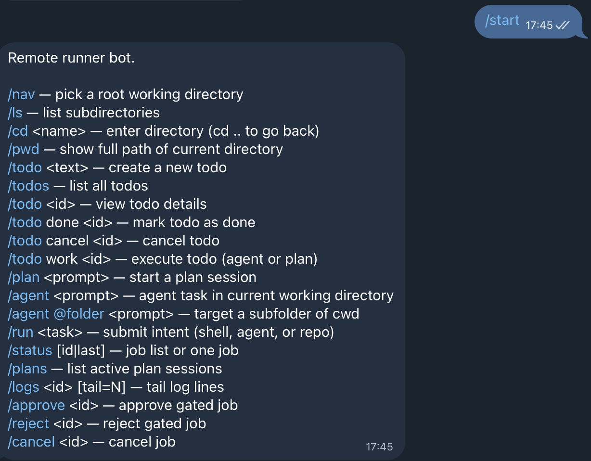
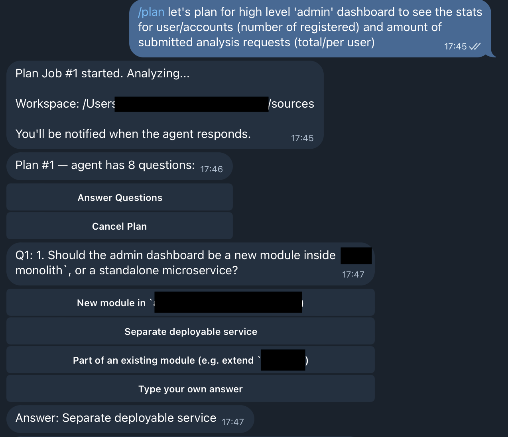

# Telegram screenshots

Static captures of the **Telegram** bot conversation. Assets live under [`docs/images/`](images/).

## `/start` and help

Bot welcome and consolidated command help (menu + `/start` text).

## Plan mode

Inline plan flow (questions, build/adjust actions, session state).

