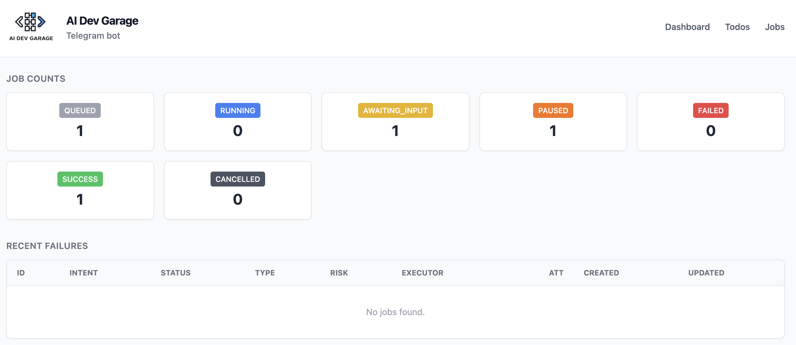
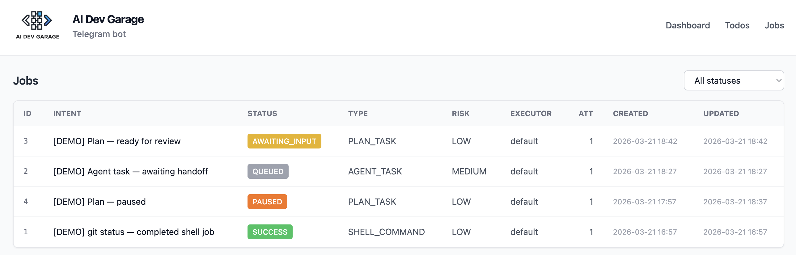
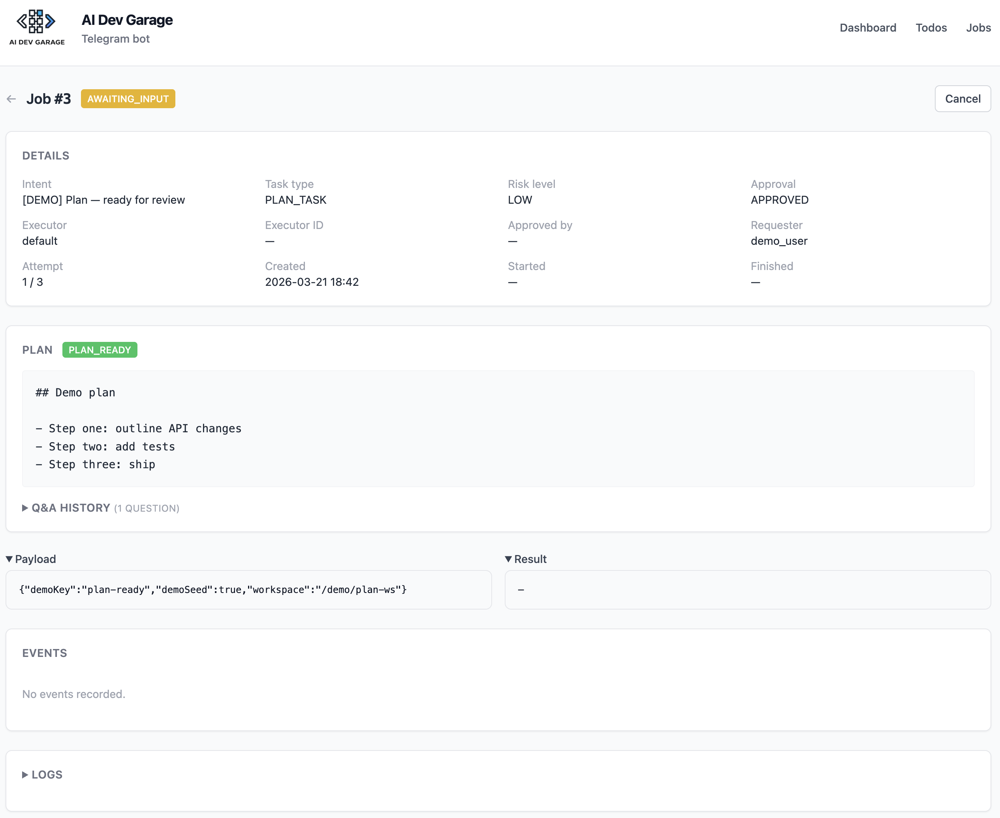
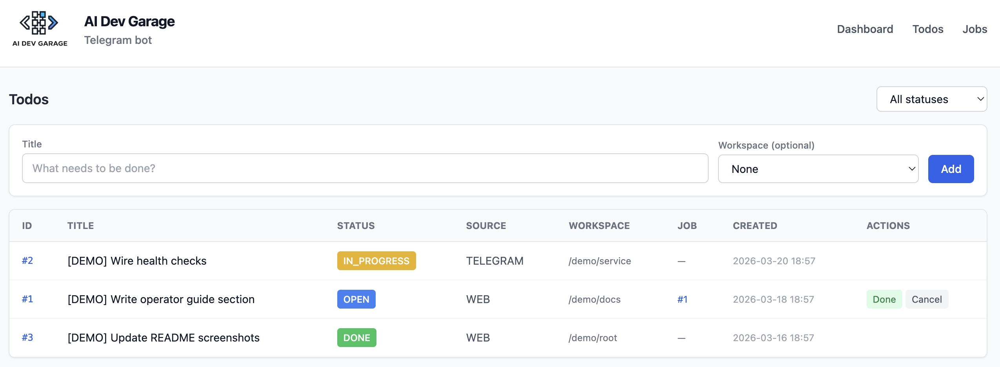

# Web UI screenshots

Static captures of the runner **web UI** (default [http://localhost:8765](http://localhost:8765)). Assets live under [`docs/images/`](images/).

## Dashboard

Overview / home after sign-in (if auth is enabled).

## Jobs list

Jobs table: status, type, and quick navigation to details.

## Job details

Single job view: payload, logs tail, and actions where applicable.

## Todos

Todo list across sources (e.g. web vs Telegram) and states.

